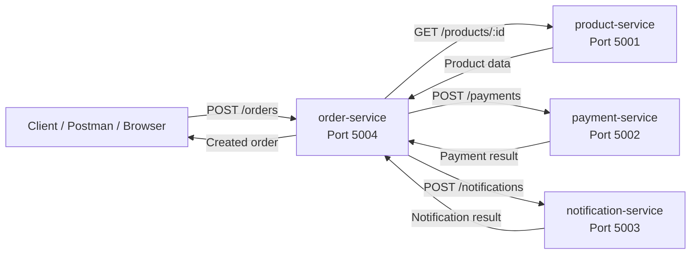
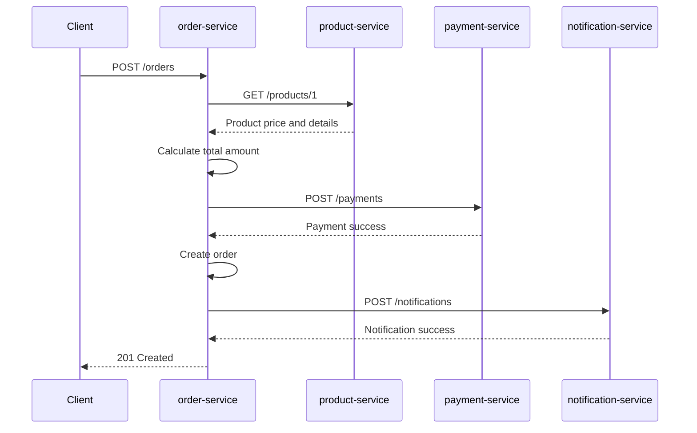
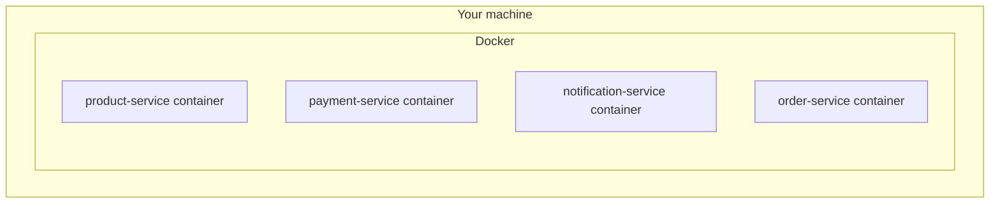
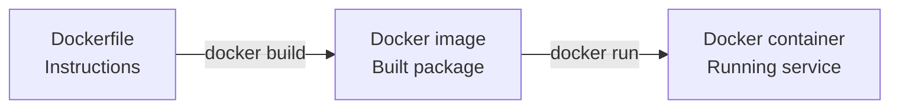
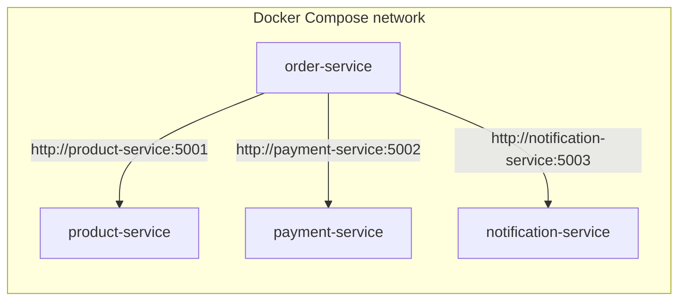
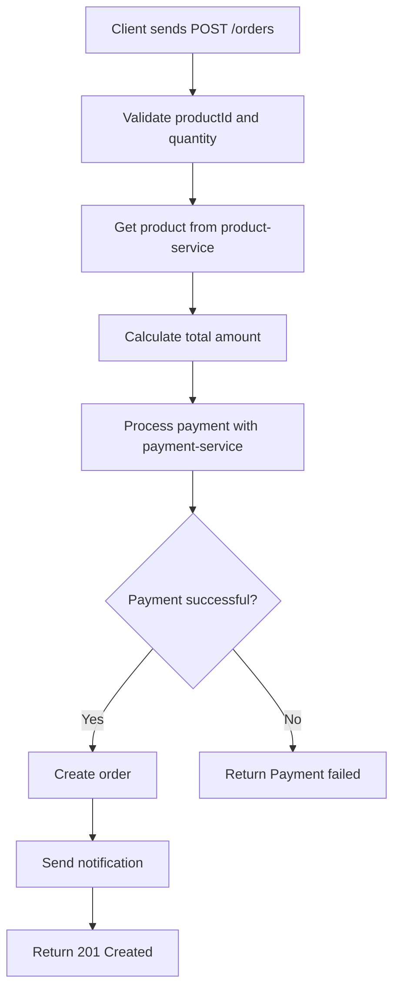
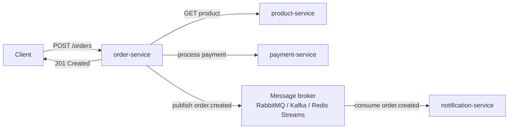
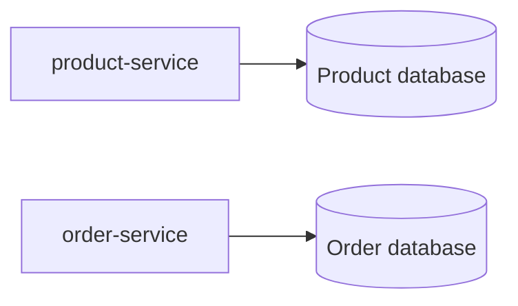
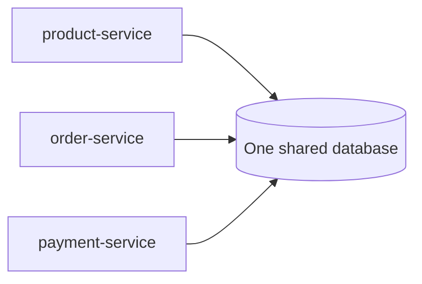
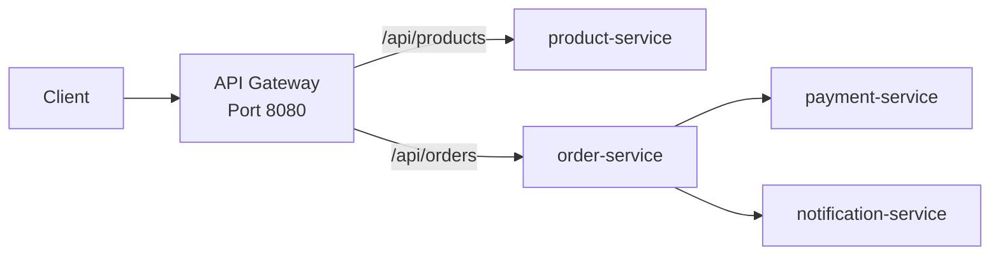

# Microservice App Course: From Local Node Services to Docker

This project is a small but real microservice system built with Node.js and Express.

It contains four services:

| Service | Port | Main responsibility |
| --- | ---: | --- |
| `product-service` | `5001` | Stores and returns product information |
| `payment-service` | `5002` | Simulates payment processing |
| `notification-service` | `5003` | Simulates sending order notifications |
| `order-service` | `5004` | Coordinates the full order flow |

The purpose of this README is to work like a mini-course. It explains what the app does, how the services communicate, why Docker helps, and how to evolve this project into a stronger microservice architecture.

---

## 1. What Is a Microservice?

A microservice is a small application that owns one clear responsibility.

Instead of building one large application that does everything, we split the system into smaller services.

In this project:

- `product-service` knows about products.
- `payment-service` knows about payments.
- `notification-service` knows about notifications.
- `order-service` knows how to create an order by talking to the other services.

This separation makes the system easier to understand, test, deploy, and scale.

---

## 2. Current Architecture

When a user creates an order, the request goes to `order-service`.

The `order-service` then talks to the other services:

1. It asks `product-service` for product details.
2. It calculates the total price.
3. It asks `payment-service` to process payment.
4. It saves the order in memory.
5. It asks `notification-service` to send a notification.



This is called service-to-service communication.

The services communicate using HTTP.

---

## 3. Request Flow Example

Imagine the client sends this request:

```bash
curl -X POST http://localhost:5004/orders \
  -H "Content-Type: application/json" \
  -d '{"productId":1,"quantity":1}'
```

The order service receives:

```json
{
  "productId": 1,
  "quantity": 1
}
```

Then the full flow looks like this:



Expected response:

```json
{
  "id": 1,
  "productId": 1,
  "quantity": 1,
  "totalAmount": 999.99,
  "payment": {
    "status": "success",
    "transactionId": "TX-...",
    "orderId": 1,
    "amount": 999.99
  },
  "status": "confirmed"
}
```

---

## 4. How to Run Without Docker

Before Docker, you run each service manually.

Open four terminals from the root project folder.

Terminal 1:

```bash
npm run product:service
```

Terminal 2:

```bash
npm run payment:service
```

Terminal 3:

```bash
npm run notification:service
```

Terminal 4:

```bash
npm run order:service
```

Then test the product service:

```bash
curl http://localhost:5001/products
```

Then create an order:

```bash
curl -X POST http://localhost:5004/orders \
  -H "Content-Type: application/json" \
  -d '{"productId":1,"quantity":1}'
```

This works, but it has problems:

- You need four terminals.
- Your machine must have the right Node.js version.
- Every developer must install dependencies correctly.
- Service URLs are tied to your local machine.
- It is harder to move the app to another environment.

Docker helps solve these problems.

---

## 5. What Docker Adds

Docker packages each service with everything it needs to run.

Think of a container as a small isolated environment for one service.



Each container has:

- Its own Node.js runtime.
- Its own installed dependencies.
- Its own app files.
- Its own startup command.

Instead of manually starting four services, Docker Compose can start the whole system:

```bash
docker compose up --build
```

---

## 6. Docker Image vs Docker Container

These two words are important.

An image is the recipe.

A container is the running thing created from that recipe.



For example:

```txt
product-service Dockerfile
        |
        v
product-service image
        |
        v
product-service container
```

---

## 7. Important Docker Networking Rule

This is one of the most important concepts.

When code runs directly on your machine, this works:

```js
const PRODUCT_SERVICE_URL = "http://localhost:5001";
```

But inside Docker, `localhost` means "inside this same container".

So if `order-service` runs inside a container, this URL:

```txt
http://localhost:5001
```

does not mean "the product-service container".

It means:

```txt
port 5001 inside the order-service container
```

That is wrong.

Docker Compose gives every service a network name. The service name becomes the hostname.

So inside Docker, the order service should call:

```txt
http://product-service:5001
http://payment-service:5002
http://notification-service:5003
```

Diagram:



---

## 8. Make Service URLs Configurable

The order service should not hardcode only `localhost`.

Better:

```js
const PRODUCT_SERVICE_URL =
  process.env.PRODUCT_SERVICE_URL || "http://localhost:5001";

const PAYMENT_SERVICE_URL =
  process.env.PAYMENT_SERVICE_URL || "http://localhost:5002";

const NOTIFICATION_SERVICE_URL =
  process.env.NOTIFICATION_SERVICE_URL || "http://localhost:5003";
```

Why this is better:

- Local development can still use `localhost`.
- Docker can use service names.
- Production can use real internal URLs.
- The same code works in multiple environments.

This is a normal microservice practice.

---

## 9. Recommended Docker Project Structure

The target structure should look like this:

```txt
microservice-app
├── docker-compose.yml
├── package.json
├── product-service
│   ├── Dockerfile
│   ├── .dockerignore
│   ├── index.js
│   └── package.json
├── payment-service
│   ├── Dockerfile
│   ├── .dockerignore
│   ├── index.js
│   └── package.json
├── notification-service
│   ├── Dockerfile
│   ├── .dockerignore
│   ├── index.js
│   └── package.json
└── order-service
    ├── Dockerfile
    ├── .dockerignore
    ├── index.js
    └── package.json
```

Each service gets its own Dockerfile because each service is independently runnable.

---

## 10. Dockerfile Template

Each service can use almost the same Dockerfile.

Example for `product-service/Dockerfile`:

```dockerfile
FROM node:22-alpine

WORKDIR /app

COPY package*.json ./

RUN npm install

COPY . .

EXPOSE 5001

CMD ["npm", "start"]
```

Line-by-line explanation:

| Line | Meaning |
| --- | --- |
| `FROM node:22-alpine` | Start from an official Node.js image |
| `WORKDIR /app` | Put the app inside `/app` in the container |
| `COPY package*.json ./` | Copy dependency files first |
| `RUN npm install` | Install dependencies inside the image |
| `COPY . .` | Copy the service source code |
| `EXPOSE 5001` | Document the port used by the service |
| `CMD ["npm", "start"]` | Start the app when the container runs |

Each service should expose its own port:

| Service | Dockerfile port |
| --- | ---: |
| `product-service` | `EXPOSE 5001` |
| `payment-service` | `EXPOSE 5002` |
| `notification-service` | `EXPOSE 5003` |
| `order-service` | `EXPOSE 5004` |

---

## 11. .dockerignore

Each service should also have a `.dockerignore` file.

Example:

```txt
node_modules
npm-debug.log
Dockerfile
.dockerignore
```

Why this matters:

- Do not copy local `node_modules` into the image.
- Let Docker install clean dependencies.
- Keep images smaller.
- Avoid weird bugs caused by local machine files.

---

## 12. docker-compose.yml

At the project root, create `docker-compose.yml`:

```yaml
services:
  product-service:
    build: ./product-service
    ports:
      - "5001:5001"

  payment-service:
    build: ./payment-service
    ports:
      - "5002:5002"

  notification-service:
    build: ./notification-service
    ports:
      - "5003:5003"

  order-service:
    build: ./order-service
    ports:
      - "5004:5004"
    environment:
      PRODUCT_SERVICE_URL: http://product-service:5001
      PAYMENT_SERVICE_URL: http://payment-service:5002
      NOTIFICATION_SERVICE_URL: http://notification-service:5003
    depends_on:
      - product-service
      - payment-service
      - notification-service
```

Important parts:

| Compose key | Meaning |
| --- | --- |
| `services` | The list of containers Docker Compose will manage |
| `build` | Folder containing the service Dockerfile |
| `ports` | Maps your computer port to the container port |
| `environment` | Sends config values into the container |
| `depends_on` | Starts dependency containers before this one |

Port mapping example:

```yaml
ports:
  - "5004:5004"
```

This means:

```txt
localhost:5004 on your machine
        |
        v
port 5004 inside the order-service container
```

---

## 13. How to Run With Docker

From the root folder:

```bash
docker compose up --build
```

What this does:

1. Builds images for all services.
2. Creates containers.
3. Creates a private Docker network.
4. Starts all services.
5. Shows logs in your terminal.

Test products:

```bash
curl http://localhost:5001/products
```

Create an order:

```bash
curl -X POST http://localhost:5004/orders \
  -H "Content-Type: application/json" \
  -d '{"productId":1,"quantity":1}'
```

See created orders:

```bash
curl http://localhost:5004/orders
```

Stop all containers:

```bash
docker compose down
```

Rebuild after code changes:

```bash
docker compose up --build
```

---

## 14. Understanding the Current Order Flow

Current order creation is synchronous.

That means every step happens before the user gets the final response.



This is simple and good for learning.

But there is an important architecture question:

Should order creation fail if notification fails?

Usually, no.

A notification can happen later. The customer should not lose their order just because the notification service is temporarily down.

That leads us to events.

---

## 15. Next-Level Architecture: Events

In a stronger microservice architecture, the order service does not directly wait for notification.

Instead:

1. The order service creates the order.
2. The order service publishes an event like `order.created`.
3. The notification service receives that event.
4. The notification service sends the notification independently.



This is called asynchronous communication.

Synchronous HTTP:

```txt
Service A calls Service B and waits for the answer.
```

Asynchronous event:

```txt
Service A publishes an event.
Service B reacts when it can.
```

For this project, RabbitMQ would be a good future step.

---

## 16. Data Ownership

Right now, the app stores data in arrays:

```js
const products = [];
const orders = [];
```

That is okay for learning, but data disappears when the service restarts.

A stronger version should use databases.

In microservice architecture, each service should own its data.

Good:



Avoid this early:



Why avoid one shared database?

- Services become tightly coupled.
- One service can accidentally break another service's data.
- It becomes harder to deploy services independently.
- Database schema changes become dangerous.

The better rule:

```txt
Each service owns its own data.
Other services ask for data through APIs or events.
```

---

## 17. API Gateway Future Step

Right now, every service is exposed:

```txt
localhost:5001/products
localhost:5002/payments
localhost:5003/notifications
localhost:5004/orders
```

In a larger system, external clients usually should not call every service directly.

Instead, you expose one API gateway:



Benefits:

- One public entry point.
- Easier authentication.
- Easier rate limiting.
- Cleaner URLs for clients.
- Internal services can stay private.

---

## 18. Learning Roadmap

Follow this order.

### Stage 1: Understand and run the current app

Goal:

```txt
Run all four services locally and create an order.
```

You should understand:

- What each service does.
- Which port each service uses.
- How `order-service` talks to the other services.

### Stage 2: Add Docker

Goal:

```txt
docker compose up --build
```

You should understand:

- What a Dockerfile is.
- What an image is.
- What a container is.
- What Docker Compose does.
- Why containers use service names instead of `localhost`.

### Stage 3: Add environment variables

Goal:

```txt
Same code works locally and inside Docker.
```

You should understand:

- Why hardcoded URLs are limiting.
- How `process.env` works.
- How Compose passes environment variables.

### Stage 4: Add health checks

Goal:

```txt
Docker knows whether each service is healthy.
```

Example:

```yaml
healthcheck:
  test: ["CMD", "wget", "-qO-", "http://localhost:5001/products"]
  interval: 10s
  timeout: 5s
  retries: 5
```

### Stage 5: Add databases

Goal:

```txt
Orders and products survive service restarts.
```

Good first database choices:

- PostgreSQL for relational data.
- MongoDB for document-style data.

### Stage 6: Add RabbitMQ

Goal:

```txt
Notification happens through events.
```

Example event:

```json
{
  "event": "order.created",
  "orderId": 1,
  "message": "Your order 1 is confirmed"
}
```

### Stage 7: Add an API Gateway

Goal:

```txt
Clients use one public API instead of calling every service.
```

Example:

```txt
GET  /api/products
POST /api/orders
```

---

## 19. Common Mistakes and How to Think About Them

### Mistake: Using localhost between containers

Wrong inside Docker:

```txt
http://localhost:5001
```

Correct inside Docker Compose:

```txt
http://product-service:5001
```

### Mistake: Sharing one database between all services

This makes services too dependent on each other.

Prefer:

```txt
service owns database
other services use APIs or events
```

### Mistake: Making every call synchronous

Some things must happen immediately, like payment.

Some things can happen later, like notification.

Good thinking:

```txt
Payment: synchronous
Notification: asynchronous event
```

### Mistake: Putting too much logic in one service

The order service coordinates the order flow, but it should not become responsible for product storage, payment logic, and notification logic.

Each service should keep a clear job.

---

## 20. Current API Reference

### Product service

Get all products:

```http
GET http://localhost:5001/products
```

Get one product:

```http
GET http://localhost:5001/products/1
```

### Payment service

Process payment:

```http
POST http://localhost:5002/payments
Content-Type: application/json

{
  "orderId": 1,
  "amount": 999.99
}
```

### Notification service

Send notification:

```http
POST http://localhost:5003/notifications
Content-Type: application/json

{
  "orderId": 1,
  "message": "Your order 1 is confirmed"
}
```

### Order service

Get all orders:

```http
GET http://localhost:5004/orders
```

Create order:

```http
POST http://localhost:5004/orders
Content-Type: application/json

{
  "productId": 1,
  "quantity": 1
}
```

---

## 21. Final Mental Model

Think of this system like a team.

The client asks:

```txt
Please create an order.
```

The order service says:

```txt
I coordinate the order.
```

The product service says:

```txt
I know product information.
```

The payment service says:

```txt
I handle payment decisions.
```

The notification service says:

```txt
I inform the customer.
```

Docker says:

```txt
I package and run every service in a predictable environment.
```

Docker Compose says:

```txt
I start the whole team together and connect them on one private network.
```

That is the foundation of this microservice architecture.

